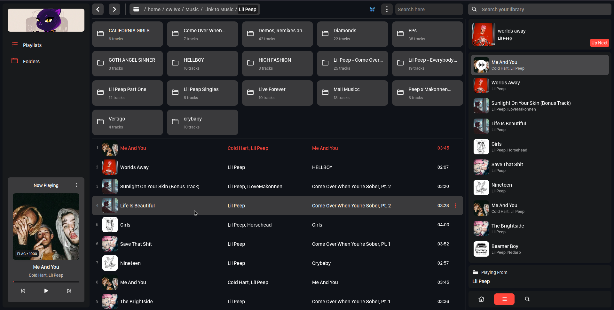
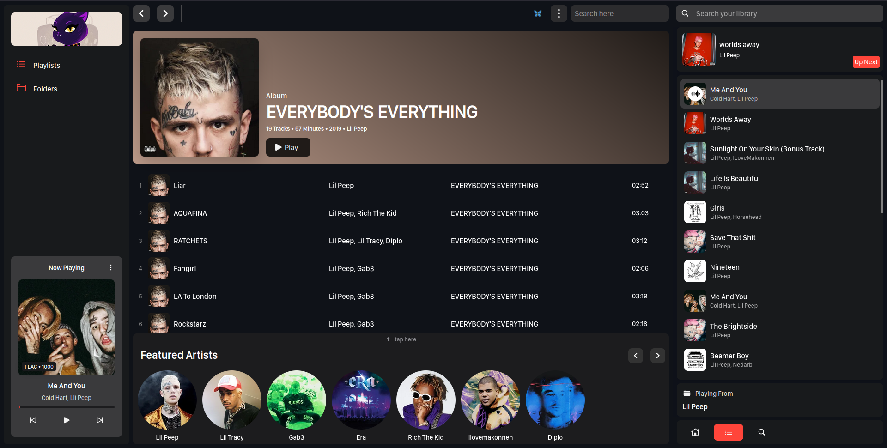
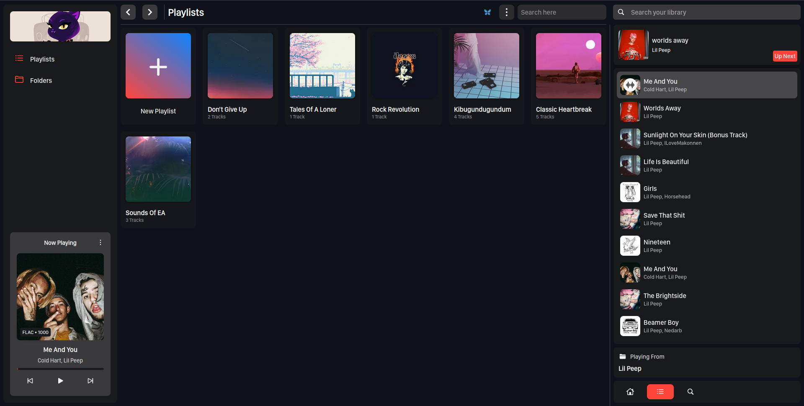
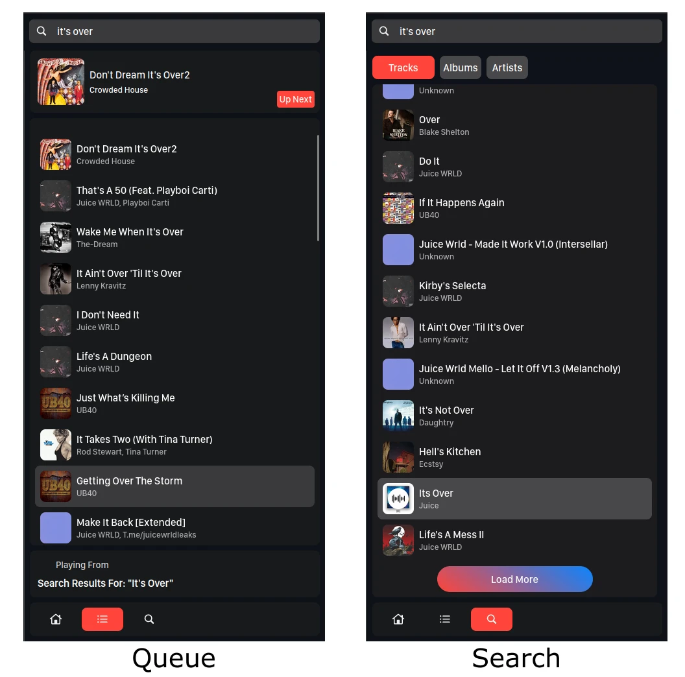
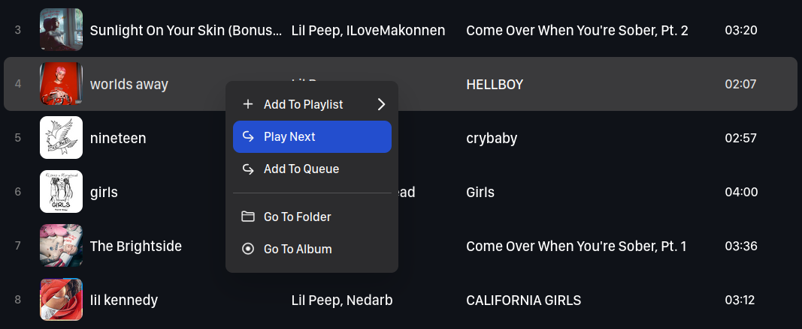

### Table of content

1. Introduction
2. Background
3. About Alice
4. Call to developers.
5. Final thoughts.

Hello `{community.name}` Community 👋

I'm Mungai. I want to introduce a project that I've been working on for some time now. Meet Alice, a music player. It's the first project that I've worked on with a lot of seriousness, passion and dedication.

### Introduction

Alice is a browser-based music player for playing local music files. Her main goal is to be a simple and beautiful music player with a lot of recommendation features. She aims:

- To unite all your scattered music files (that you often don't listen to) into a library that that you can browse and play around with.
- To provide a better user experience when interacting with your music.
- To link your music files into a graph that you can explore and build amazing playlists from.
- To provide smart recommendations based on your listening activity.
- To show connections between your music files, similar tracks, albums and artists.
- And more.

### Current progress

At the moment, these are the working features:

1. Browsing music using a file manager-like interface.
2. Building playlists. including customization.
3. Searching your library for tracks, albums and artists.
4. Playing music.
5. Browsing a track's album page.
6. Viewing the album bio (uses the Lastfm API).
7. Viewing the featured artists in an album.

At this point the app has only 4 functional pages:

1. The folders page
2. Album page
3. Playlist list page
4. Playlist page

#### 1. The folders page

You can browse through all your folders from here. This page shows all the folders and tracks inside a given directory. Only the folders with music files are displayed. You can click on a track to play it or a folder to see the tracks inside.

Here's how this looks like:

#### 2. Album page

You can go to a track's album page by clicking on a track's album name or by using the `Go to album` option in the context menu. You can see all the tracks in the album, featured artists and the album bio from the album page.

### 3. Playlist list page

This page shows all the playlists that you have created. You can click on a playlist to see the tracks in it.

### 4. Playlist page

This page shows the playlist information and tracks inside it. You can customize the playlist banner image and description from here.

<!-- image here -->

---

The app features a fixed sidebar that shows the queue and the next track at the top. Searching is also nested in the sidebar.

You can also add individual tracks to the queue by right clicking on a track and selecting `Play next` to play the track after the current track or `Add to queue` to append to the queue.

### Architecture

Alice consists of 2 parts. A server which interacts with your music files, the database, and the required APIs. This is basically the brain of the whole application. The server is written in Python and uses:

- Mutagen: to read music metadata.
- Flask: to serve the web application.
- Pymongo: to interact with MongoDB (more on this later)

The second part is a client that runs on the browser. This is the face of the application and where you interact with your music. It's written in Vue 3 and uses:

- Pinia: to manage the application state.
- Axios: to interact with the server.

The server reads all the files in the filesystem, to be specific everything under the `~/` directory and exposes this data via the Flask REST API. The Vue client reads from this API and displays the files. When you want to play a track, the server will stream the file to the client. Images are served using another standalone Flask application.

> The app is currently running on MongoDB. This is because when I was starting out, I was just looking to build a simple app for personal use and I use MongoDB for all my personal projects. There are plans to add support for SQLite soon.

### Planned features

Besides the normal basic music player features, here are some cool features that are planned for future releases:

1. A better search implementation, with a better search algorithm. The server uses a Levischtein distance algorithm to find the closest matches (and it's nowhere near perfect).
2. An artist page to show all the albums, tracks, bio, etc of an artist.
3. Ability to generate mixes based on your listening activity.
   <!--  -->
   This will rely on Lastfm's album tags and similar artists data, combined with spotify's audio data. See:
   - [LastFM `tag.getTopAlbums`](https://www.last.fm/api/show/tag.getTopAlbums)
   - [Spotify `audio.getAudioFeatures`](https://developer.spotify.com/web-api/get-audio-features/)
4. A neat homepage to show various mixes, recommendations, etc.
5. Abililty to see related artists, albums, etc.
6. Ability to suggest tracks, albums, artists, based on the current playing track.
7. Ability to save albums, folders, etc as playlists.
8. Ability to use a spotify playlist details in your playlists.
9. Statistics to show your listening trends.
10. Synced and unsynced lyrics support
11. A lot more.

Those are more than enough for this post. I forgot most other better features but that'll do for now. If you have any suggestions, please let me know.

### Want to try it out?

If you would like to test out the app, see the dev setup instructions `here`. The app has only been tested in Ubuntu with Python >3.8.

The development setup requires the following tools to be installed:

1. [Python >=3.8](https://www.python.org/downloads/)
2. [Poetry](https://python-poetry.org/)
3. [Node.js >= v14](https://nodejs.org/)
4. [Yarn](https://yarnpkg.com/)

If you have a windows system, please try to setup the app on your system and open an issue or pull request to fix issues you might encounter.

### Want to contribute?

Building Alice alone has been a bit of a challenge. I've been working on both the server, the client and the UI design solo and it's demanding, considering that I'm a noob and a student.

If you would like to contribute to this amazing project, please fork the repository, go through the code and open an issue or pull request. Your contributions will be greatly appreciated.

Here are some of the issues that need your help:

#### Server issues

1. [Adding SQLite support #n]()
2. [Better search algorithm implementation #n]()
3. [Adding analytics #n]()
4. [Saving folder as album #n]()

#### Client issues

1. [Adding UI animations, better UX #n]()
2. [Adding a virtual scroller #n]()
3. [Improved responsiveness #n]()
4. [Context menu normalization #n]()
5. [Add In-page search #n]()
